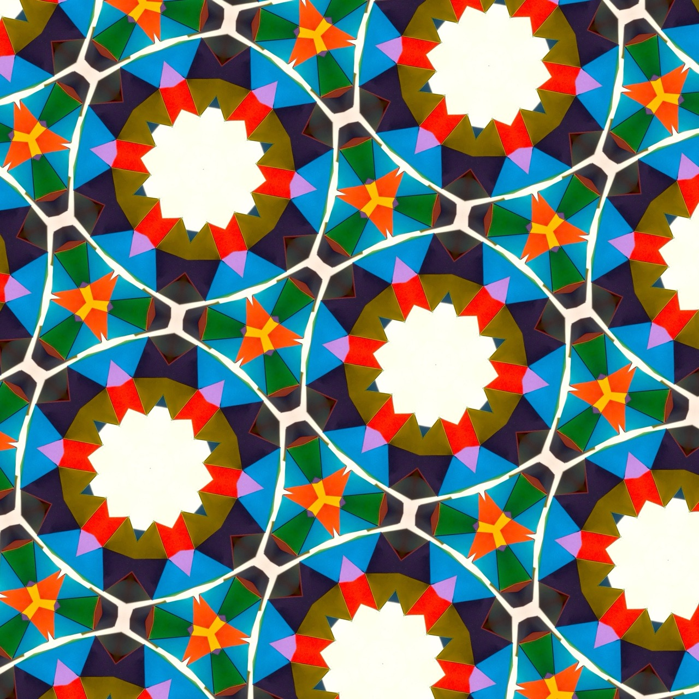
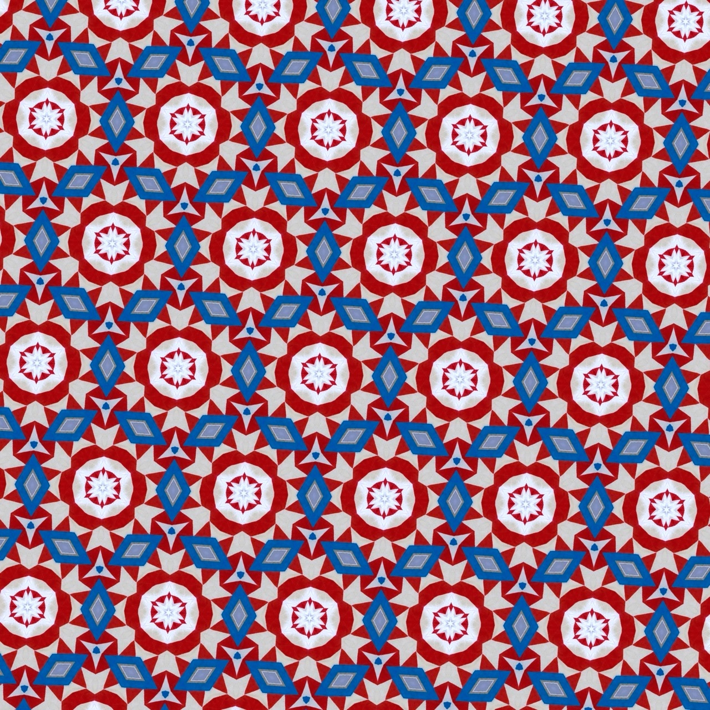

Use your camera to create kaleidoscope art from your environment.

You can find a demo at [kaleidoscope.leifgehrmann.com](https://kaleidoscope.leifgehrmann.com/).

## Controls

* 🔍 Zoom by dragging up and down (or scrolling) on the screen.
* 🔄 Rotate by dragging left and right (or horizontal scrolling) on the screen.
* 🔼 Switch between the four kaleidoscope shapes using the menu at the bottom.
* 🎠 Auto-rotate using the "steering widget" by dragging it left and right to control the speed.
* 💾 Save the image by right-clicking or long-pressing the screen.

### Keyboard controls

* `WASD` to control the zoom and rotation.
* `IJKL` to control the "offset" (warning, it'll get really weird)
* `H` to hide the controls.
* `Tab + Space + Left/Right` to switch between kaleidoscope shapes. 

## Examples

|                                                                                                                          |                                                                                     |
|--------------------------------------------------------------------------------------------------------------------------|-------------------------------------------------------------------------------------|
|                                                            |          |
|                                        |   |
|                                                         |     |
|  |     |
|                                                               |  |

## Development

```
# Assuming npm is installed on the machine, install the dependencies.
npm install

# Start a development server, with hot-reloading.
npm run dev

# Checks that code follows the style guide.
npm run lint

# Generate a publishable build in dist, and start a server that hosts the app.
npm run build
npm run preview
```
